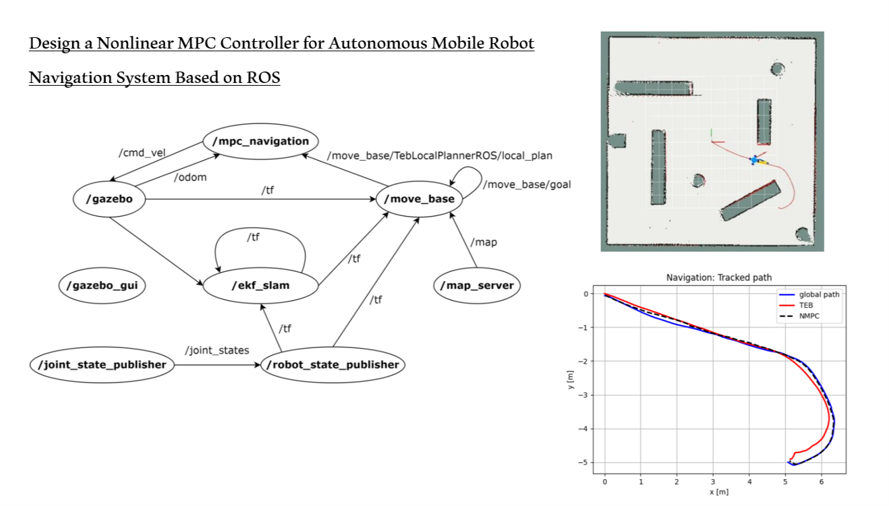

# mobile_robot_mpc_controller

## Introduction
This code contains the implementation of Model Predictive Controller for a Mobile robot using ROS framework and ADACO library for our paper: ["Design a Nonlinear MPC Controller for Autonomous Mobile Robot Navigation System Based on ROS"](http://www.ijmerr.com/uploadfile/2022/0510/20220510115959828.pdf)

## Our contributions
1. Desgining MPC controller for four wheel omni robot to track the refernce path.
2. The controller is integrated to TEB local planner in ROS framework to track the local path of TEB.

## Results

